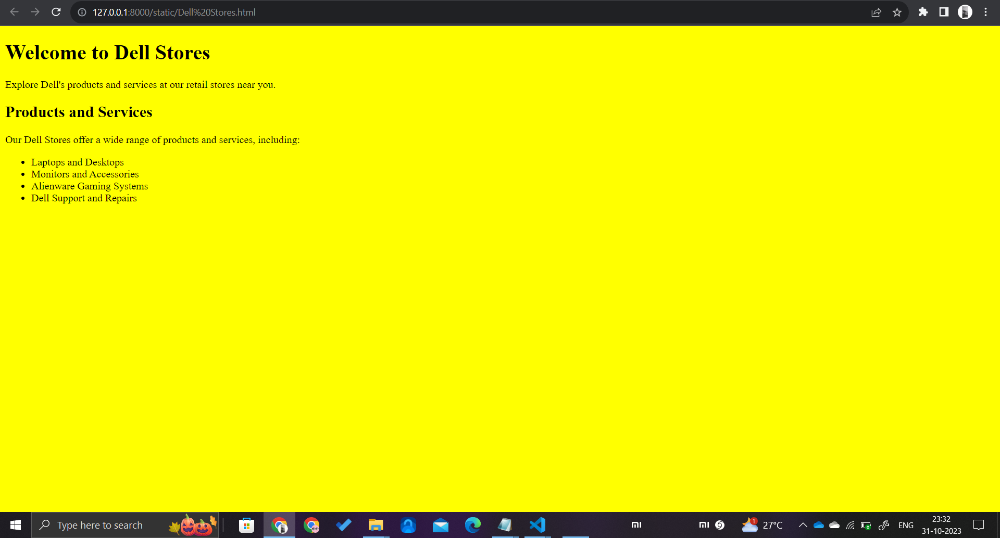

### Date-19/10/2023

# Ex04 Places Around Me
## AIM
To develop a website to display details about the places around my house.

## DESIGN STEPS

### STEP 1
Create a Django admin interface.

### STEP 2
Download your city map from Google.

### STEP 3
Using ```<map>``` tag name the map.

### STEP 4
Create clickable regions in the image using ```<area>``` tag.

### STEP 5
Write HTML programs for all the regions identified.

### STEP 6
Execute the programs and publish them.

## CODE

### map.html

```
<!DOCTYPE html> 
<html> 
  
<h3>Mapping an Image 
  
<body> 
  
<p>Click on the different continents of the map to know about them.</p> 
  
  


<map name="image-map">
    <area target="_blank" alt="Chengalpattu Bustand" title="Chengalpattu Bustand" href="Chengalpattu Bustand.html" coords="546,18,710,72" shape="rect">
    <area target="_blank" alt="Chengalpattu Government Hospital" title="Chengalpattu Government Hospital" href="Chengalpattu Government Hospital.html" coords="834,411,1051,460" shape="rect">
    <area target="_blank" alt="Lathaa Cinemas" title="Lathaa Cinemas" href="Lathaa Cinemas.html" coords="522,595,713,662" shape="rect">
    <area target="_blank" alt="Dell Stores" title="Dell Stores" href="Dell Stores.html" coords="868,242,650,177" shape="rect">
    <area target="_blank" alt="Semmalai Murugan Temple" title="Semmalai Murugan Temple" href="Semmalai Murugan Temple.html" coords="59,289,267,395" shape="rect">
</map>
  
</body> 
</html> 
```

### Chengalpattu Bustand.html
```
<!DOCTYPE html>
<html>
<head>
    <title>Chengalpattu Bus Stand Information</title>
</head>
<body bgcolor="grey">
    <h1>Chengalpattu Bus Stand</h1>
    <p>Welcome to Chengalpattu Bus Stand, a major transportation hub in the Chengalpattu district of Tamil Nadu, India.</p>
    
    <h2>Location</h2>
    <p>The bus stand is located in the heart of Chengalpattu, making it a convenient point for travelers heading to various destinations in the region.</p>
    
    <h2>Facilities</h2>
    <p>Chengalpattu Bus Stand offers a range of facilities for travelers, including ticket counters, waiting areas, restrooms, and shops for refreshments and essentials.</p>
    
    <h2>Transportation Services</h2>
    <p>It serves as a central hub for various bus services, connecting Chengalpattu to nearby towns and cities. You can find buses for both short and long-distance journeys.</p>
    
    <h2>Operating Hours</h2>
    <p>The bus stand typically operates from early morning until late evening, and some services might run 24/7 for the convenience of passengers.</p>
    
</body>
</html>
```

### Chengalpattu Government Hospital.html
```

<!DOCTYPE html>
<html>
<head>
    <title>Chengalpattu Government Hospital</title>
</head>
<body bgcolor="pink">
    <h1>Chengalpattu Government Hospital</h1>
    <p>Welcome to Chengalpattu Government Hospital, a prominent healthcare facility in Chengalpattu, Tamil Nadu, India.</p>
    
    <h2>Location</h2>
    <p>The hospital is situated in the heart of Chengalpattu, easily accessible to residents and those in need of medical care in the region.</p>
    
    <h2>Services</h2>
    <p>Chengalpattu Government Hospital provides a wide range of medical services, including but not limited to:</p>
    <ul>
        <li>Emergency Care</li>
        <li>Inpatient Services</li>
        <li>Outpatient Services</li>
        <li>Surgical Facilities</li>
        <li>Diagnostic Services</li>
        <li>Specialty Clinics</li>
        <li>Maternity and Pediatric Care</li>
        <li>Pharmacy Services</li>
    </ul>
    
    <h2>Operating Hours</h2>
    <p>The hospital operates 24/7 to provide continuous healthcare services to the community.</p>
    
   
</body>
</html>

```

### Dellstore.html
```
<!DOCTYPE html>
<html>
<head>
    <title>Dell Stores</title>
</head>
<body bgcolor="yellow">
    <h1>Welcome to Dell Stores</h1>
    <p>Explore Dell's products and services at our retail stores near you.</p>

    <h2>Products and Services</h2>
    <p>Our Dell Stores offer a wide range of products and services, including:</p>
    <ul>
        <li>Laptops and Desktops</li>
        <li>Monitors and Accessories</li>
        <li>Alienware Gaming Systems</li>
        <li>Dell Support and Repairs</li>
    </ul>

    
</body>
</html>

```

### Lathaa Cinemas.html
```
<!DOCTYPE html>
<html>
<head>
    <title>Lathaa Cinemas</title>
</head>
<body bgcolor="lightblue">
    <h1>Welcome to Lathaa Cinemas</h1>
    <p>Lathaa Cinemas is a popular movie theater in chengalpattu, known for its great movie-going experience.</p>
    
    <h2>Location</h2>
    <p>Lathaa Cinemas is located at chengalpattu .It's easily accessible and a favorite spot for movie enthusiasts.</p>
    
    <h2>Movie Showtimes</h2>
    <p>Check out the latest movie showtimes at Lathaa Cinemas and plan your visit accordingly. You can purchase tickets online or at the theater.</p>
    
    <h2>Facilities</h2>
    <p>Lathaa Cinemas provides various amenities for a comfortable movie experience, including:</p>
    <ul>
        <li>Multiple Screens</li>
        <li>Comfortable Seating</li>
        <li>Concession Stand for Snacks and Drinks</li>
        <li>Audio and Video Quality</li>
        <li>Accessible Seating for Special Needs</li>
    </ul>
    
</body>
</html>

```

### Semmalai Murugan Temple.html
```

<!DOCTYPE html>
<html>
<head>
    <title>Semmalai Murugan Temple</title>
</head>
<body bgcolor="orange">
    <h1>Welcome to Semmalai Murugan Temple</h1>
    <p>Explore the divine beauty of Semmalai Murugan Temple, a sacred place of worship.</p>

    <h2>Location</h2>
    <p>Semmalai Murugan Temple is situated in chengalpattu. It is a revered destination for devotees and visitors.</p>

    <h2>About the Temple</h2>
    <p>Semmalai Murugan Temple is dedicated to Lord Murugan, the Hindu deity of war and victory. The temple is known for its spiritual significance and architectural beauty.</p>

    <h2>Key Features</h2>
    <p>The temple offers several features and amenities, including:</p>
    <ul>
        <li>Main Sanctum for Lord Murugan</li>
        <li>Secondary Deities and Shrines</li>
        <li>Prayer Halls</li>
        <li>Festivals and Celebrations</li>
        <li>Pilgrimage Facilities</li>
    </ul>

</body>
</html>
```


## OUTPUT





## RESULT
The program for implementing image maps using HTML is executed successfully.
